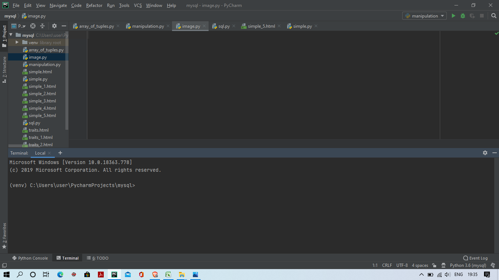

# Database-of-Indian-Celebrities-with-their-personality-traits
A database of Bollywood Celebrities with their images and their personality traits created using Web-scrapping and **lxml** as the parser

## Install the package dependencies:
While in the root directory, run the following command:
` pip3 install -r requirements.txt`

## Getting started:
1. Open system terminal 

2. Type in the command inside the root directory:
`pip3 install -r requirements.txt`

3. Go to the **manipulation.py** folder and run the script 

## Information about the files:
1) traits, traits_1 , traits_2                                    ---> HTML files for extracting the traits from the website
2) simple , simple_1, simple_2 , simple_3 , simple_4 , simple_5   ---> HTML files for extracting the image URL's from the website
3) simple.py                                                      ---> Python file for extracting features from the simple.html files
4) manipulation.py                                                ---> Main Python file for carrying out the processes
5) requirements.txt                                         ---> Text file containing the libraries required for carrying out the project(should be run at first to install necessary packages for this project)
6) n1.csv                                                   --->  The final database in xlsx format
